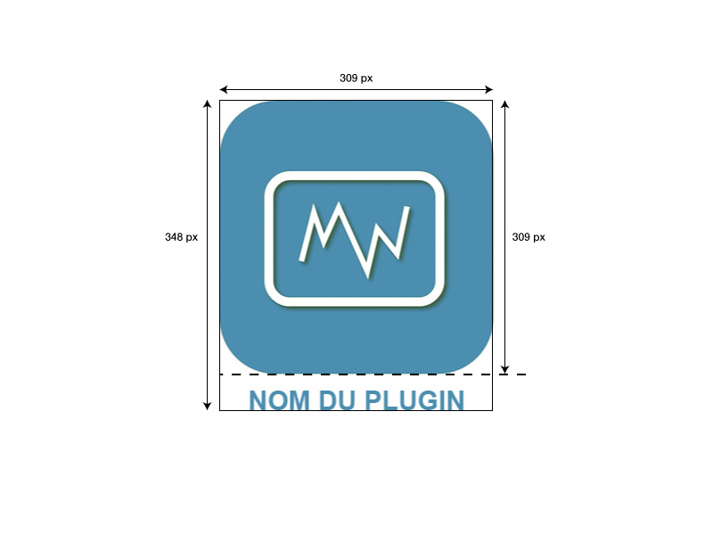

**Dokumentation, Plugin Symbole**

Um auf dem Jeedom Markt veröffentlicht zu werden, muss jedes Plugin ein Symbol haben.

Dieses Symbol wird für Benutzer, auf dem Markt und von der Jeedom-Schnittstelle angezeigt.

Es ist notwendig, eine Datei im PNG-Format von 309 x 348 Pixel zu erstellen.

Der Name der Datei ist so aufgebaut : <plugin-id>_icon.png

Sie muss in den Ordner /plugin-info/ gespeichert werden.

Diese Datei ist erforderlich.

Wir danken Ihnen im Voraus dafür, dass Sie nicht den gleichen Farbcode wie die offiziellen Jeedom Plugin Icons verwenden.

Modell :

